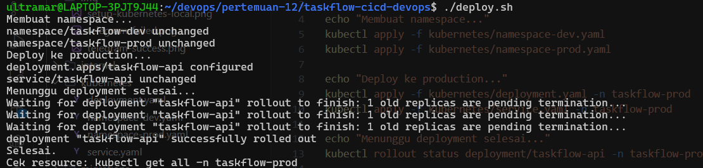
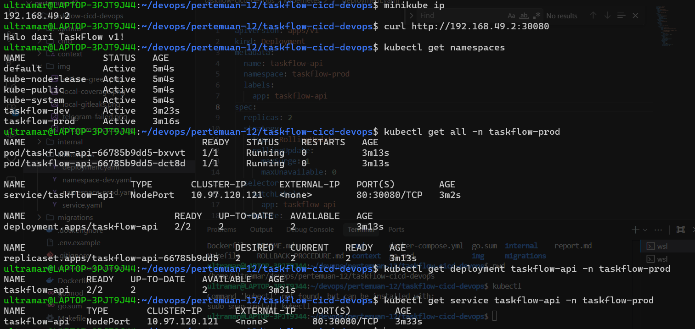
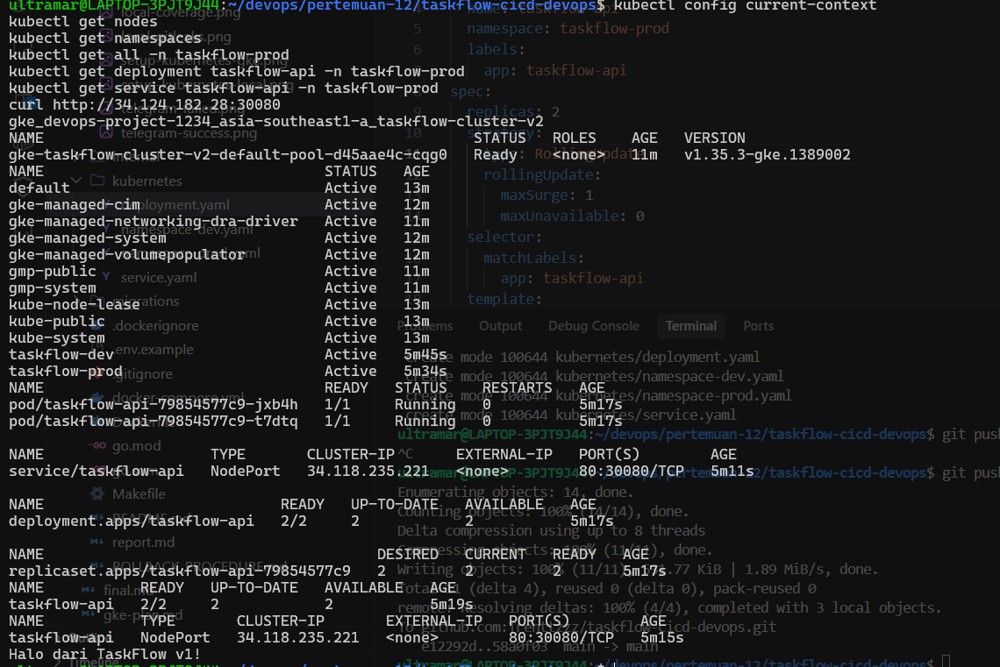
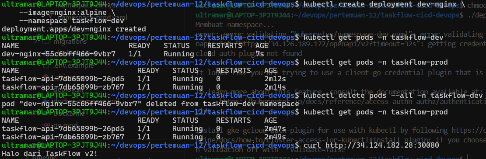
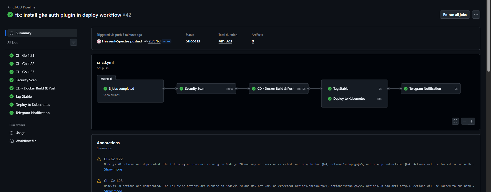

# TaskFlow API — CI/CD, Kubernetes, dan GKE

Proyek Go ini adalah source code dan deployment lab untuk mata kuliah Operasional Pengembang (DevOps). Repository ini awalnya dipakai untuk tugas CI/CD, lalu dilanjutkan pada Week 12 untuk menjalankan aplikasi di Kubernetes dan mengintegrasikan pipeline GitHub Actions ke cluster Kubernetes.

Tool utama:

- Go 1.22
- Docker
- GitHub Actions
- GHCR
- Kubernetes
- Minikube untuk demo lokal
- Google Kubernetes Engine (GKE) untuk deployment cloud

## Quick Start

```bash
# Cara 1: Full stack dengan Docker Compose (tidak perlu Go terinstall)
docker compose up -d
curl http://localhost:8080/health

# Cara 2: Development lokal (butuh Go 1.22+)
cp .env.example .env          # edit DATABASE_URL jika perlu
make db-up                    # start postgres
make test                     # unit test (tanpa DB)
make test-integration         # integration test (butuh DB aktif)
make build                    # compile binary
./bin/taskflow-api
```

## Kubernetes Deployment (Week 12)

Folder `kubernetes/` berisi manifest dasar untuk menjalankan TaskFlow di Kubernetes.

| File | Keterangan |
|------|------------|
| `kubernetes/namespace-dev.yaml` | Namespace development: `taskflow-dev` |
| `kubernetes/namespace-prod.yaml` | Namespace production: `taskflow-prod` |
| `kubernetes/deployment.yaml` | Deployment `taskflow-api` dengan 2 replica dan rolling update |
| `kubernetes/service.yaml` | Service `NodePort` pada port `30080` |

Manifest awal memakai image placeholder:

```text
hashicorp/http-echo:latest
```

Image ini dipakai agar validasi Kubernetes mudah dilakukan. Pada tahap CI/CD, GitHub Actions mengganti image Deployment ke image GHCR:

```text
ghcr.io/trenttzzz/taskflow-cicd-devops:sha-<commit>
```

### Deploy Manual

Pastikan `kubectl` sudah mengarah ke cluster yang benar:

```bash
kubectl config current-context
kubectl get nodes
```

Deploy:

```bash
kubectl apply -f kubernetes/namespace-dev.yaml
kubectl apply -f kubernetes/namespace-prod.yaml
kubectl apply -f kubernetes/deployment.yaml -n taskflow-prod
kubectl apply -f kubernetes/service.yaml -n taskflow-prod
```

Tunggu rollout:

```bash
kubectl rollout status deployment/taskflow-api -n taskflow-prod --timeout=180s
```

Verifikasi resource:

```bash
kubectl get namespaces
kubectl get all -n taskflow-prod
kubectl get deployment taskflow-api -n taskflow-prod
kubectl get service taskflow-api -n taskflow-prod
```

Untuk Minikube, akses aplikasi dengan:

```bash
curl http://$(minikube ip):30080
```

Untuk GKE, akses melalui external IP node jika firewall TCP `30080` sudah dibuka ke IP penguji:

```bash
curl http://<NODE_EXTERNAL_IP>:30080
```

Output yang diharapkan:

```text
Halo dari TaskFlow v1!
```

### Deploy Script

Repository menyediakan `deploy.sh` untuk setup namespace dan deploy production:

```bash
chmod +x deploy.sh
./deploy.sh
```

Bukti eksekusi:



## Bukti Skenario Kubernetes

| Skenario | Dokumen | Bukti |
| --- | --- | --- |
| Setup Kubernetes lokal dan GKE | README ini | `img/setup-kubernetes-local.png`, `img/setup-kubernetes-gke.png` |
| Insiden 1: Self-healing | `docs/insiden-1-selfhealing.md` | `img/self-healing-1.png`, `img/self-healing-2.png` |
| Insiden 2: Rolling update tanpa downtime | `docs/insiden-2-rolling-update.md` | `img/rolling-no-downtime-1.png`, `img/rolling-no-downtime-2.png`, `img/rolling-no-downtime-3.png` |
| Insiden 3: Rollback cepat | `docs/insiden-3-rollback.md` | `img/rollback.png` |
| Namespace isolation | README ini | `img/namespace-isolation.png` |
| CI/CD ke Kubernetes | `docs/cicd-ke-kubernetes.md` | `img/ci-cd-kubernetes.png` |

### Setup Kubernetes

Minikube lokal:



GKE:



### Namespace Isolation

Namespace `taskflow-dev` dan `taskflow-prod` dibuat terpisah. Pada demo, Pod di namespace dev dihapus, sementara Pod production tetap `Running` dan aplikasi production tetap bisa diakses.



## Integrasi CI/CD ke Kubernetes

Workflow utama berada di:

```text
.github/workflows/ci-cd.yml
```

Pipeline berjalan pada push atau pull request ke branch `main` dan `develop`.

Tahapan utama:

```text
CI matrix Go -> Security scan -> Docker build & push -> Tag stable -> Deploy to Kubernetes -> Telegram notification
```

Job `deploy-kubernetes` melakukan:

1. Setup `kubectl`.
2. Authenticate ke Google Cloud.
3. Install `gke-gcloud-auth-plugin`.
4. Decode kubeconfig dari secret `KUBECONFIG_BASE64`.
5. Update image Deployment:

   ```bash
   kubectl set image deployment/taskflow-api taskflow-api=<image-ghcr> -n taskflow-prod
   ```

6. Menunggu rollout selesai.

Secrets yang dibutuhkan:

| Secret | Fungsi |
| --- | --- |
| `KUBECONFIG_BASE64` | Kubeconfig GKE dalam format base64 |
| `GCP_SA_KEY` | JSON key Service Account Google Cloud untuk autentikasi GKE |
| `TELEGRAM_TOKEN` | Token bot Telegram |
| `TELEGRAM_TO` | Chat ID tujuan notifikasi |

Bukti pipeline sukses:



## Makefile Targets

| Target | Keterangan |
|--------|------------|
| `make vet` | Analisis statis `go vet` |
| `make test` | Unit test (tanpa database) |
| `make test-race` | Unit test + race detector |
| `make test-cover` | Coverage report |
| `make test-integration` | Integration test (butuh `DATABASE_URL`) |
| `make build` | Compile binary ke `bin/taskflow-api` |
| `make docker-build` | Multi-stage Docker image |
| `make docker-push` | Push image ke registry |
| `make docker-stable` | Tag image sebagai `:stable` |
| `make rollback ROLLBACK_TAG=sha-xxxxx` | Rollback ke versi tertentu |
| `make db-up` | Start postgres via Docker Compose |
| `make up` | Start full stack (postgres + app) |

## API Endpoints

| Method | Path | Keterangan |
|--------|------|------------|
| GET | `/health` | Health check |
| GET | `/api/v1/tasks` | List task (`?status=todo\|in_progress\|done`) |
| POST | `/api/v1/tasks` | Buat task baru |
| GET | `/api/v1/tasks/{id}` | Ambil task |
| PUT | `/api/v1/tasks/{id}` | Update task |
| DELETE | `/api/v1/tasks/{id}` | Hapus task |
| GET | `/api/v1/stats` | Statistik |

## Environment Variables

| Variable | Default | Keterangan |
|----------|---------|------------|
| `DATABASE_URL` | *(kosong)* | Jika tidak di-set → pakai MemoryRepository |
| `PORT` | `8080` | Port server |

## Arsitektur

```
cmd/server/main.go          ← Entry point
internal/
  handler/handler.go        ← HTTP layer (Go 1.22 routing)
  service/service.go        ← Business logic
  repository/
    repository.go           ← Interface
    memory.go               ← In-memory (unit test)
    postgres.go             ← PostgreSQL via pgx/v5 (production)
  model/task.go             ← Struct & types
  validator/validator.go    ← Input validation
migrations/001_create_tasks.sql  ← Skema database
```

> **Catatan untuk mahasiswa**: Kode ini mengandung **3 bug yang disengaja**.
> Lihat `pbl-cicd-problem.md` untuk detail skenario dan instruksi lengkap.
