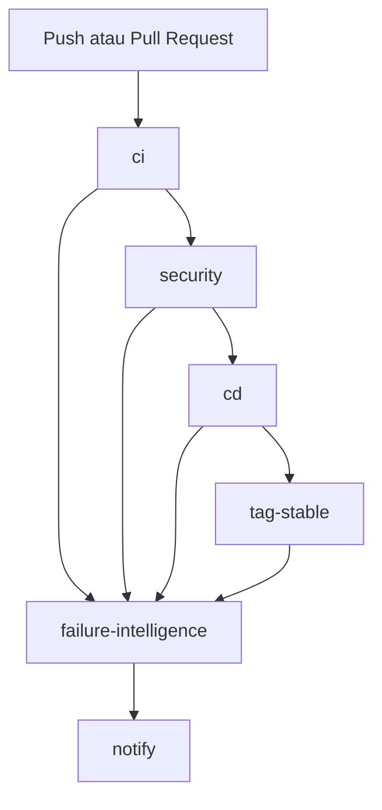
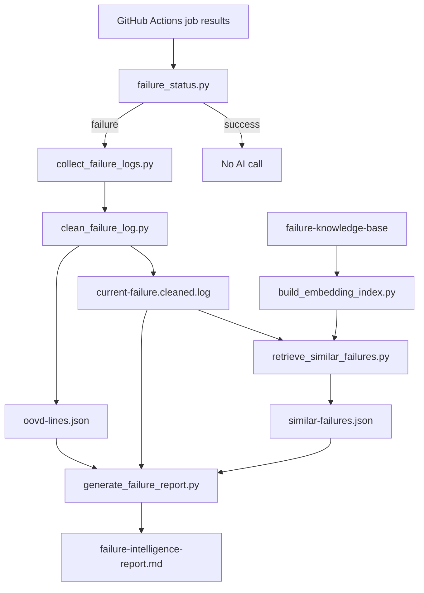

# TaskFlow API - CI/CD with AI Failure Intelligence

TaskFlow adalah REST API Go untuk manajemen task yang dipakai sebagai studi kasus DevSecOps. Final project ini menambahkan **AI Failure Intelligence** ke pipeline GitHub Actions agar pipeline tidak hanya memberi raw log ketika gagal, tetapi juga menghasilkan debugging report berbasis evidence.

Fokus final project terbaru:

- CI, security scan, Docker build, GHCR push, local smoke test, stable image tag, dan Telegram notification.
- AI report hanya dibuat saat pipeline gagal.
- GKE/Kubernetes tidak menjadi jalur utama workflow terbaru. Dokumentasi Kubernetes lama tetap dipertahankan sebagai dokumentasi legacy.
- Retrieval failure memakai `gemini-embedding-2`.
- Report diagnosis memakai `gemma-4-31b-it`.
- Satu secret `GEMINI_API_KEY` dipakai untuk embedding dan LLM.

## Final Project Summary

Masalah utama yang diselesaikan:

| Masalah | Solusi di project ini |
| --- | --- |
| Pipeline failure hanya memberi raw log panjang. | Log dikumpulkan, dibersihkan, lalu diringkas menjadi AI debugging report. |
| Failure yang mirip sering berulang. | Sistem mencari Top-3 similar failures dari knowledge base. |
| LLM raw tanpa grounding bisa hallucinate. | LLM hanya menjadi explanation layer setelah retrieval berbasis embedding. |
| AI call saat sukses memboroskan biaya. | Guard `failure_status.py` memastikan AI hanya dipanggil saat ada failure. |
| Dataset real failure masih kecil. | Synthetic validated logs dipakai sebagai cold-start knowledge base dan dievaluasi dengan controlled scenarios. |

Alur ringkas:

```text
Pipeline success
  -> write success status
  -> no embedding call
  -> no Gemma call

Pipeline failure
  -> collect failed job logs
  -> clean and mask logs
  -> extract OOVD-inspired suspicious lines
  -> retrieve Top-3 similar failures
  -> generate Gemma report
  -> upload ai-reports artifact
  -> send Telegram failure summary
```

## Workflow Terbaru

Workflow utama:

```text
.github/workflows/ci-cd.yml
```

Trigger:

```text
push ke main/develop
pull_request ke main/develop
```

Job:

| Job | Fungsi |
| --- | --- |
| `ci` | Matrix Go 1.21, 1.22, 1.23; vet, unit test race, integration test, coverage gate, build binary. |
| `security` | `govulncheck` dan `gosec`, lalu fail jika ada finding blocking. |
| `cd` | Build dan push Docker image ke GHCR, run container lokal, smoke test `/health` dan `/api/v1/stats`. |
| `tag-stable` | Tag image sukses sebagai `stable`. |
| `failure-intelligence` | Selalu berjalan, tetapi hanya memanggil AI jika job utama gagal. |
| `notify` | Mengirim Telegram success/failure summary. |



Catatan penting:

- `failure-intelligence` memakai `if: always()` agar tetap bisa membaca status job sebelumnya.
- AI tetap tidak dipanggil saat semua job sukses.
- Bukti AI report GitHub Actions baru akan muncul setelah workflow berjalan di GitHub, sehingga perlu push atau pull request untuk melihat artifact live.

## Quick Start API

### Docker Compose

```bash
docker compose up -d
curl http://localhost:8080/health
```

### Development Lokal

```bash
cp .env.example .env
make db-up
make test
make test-integration
make build
./bin/taskflow-api
```

## Quick Start AI Failure Intelligence

Masuk ke folder repository:

```bash
cd taskflow-cicd-devops
```

Siapkan API key lokal:

```bash
cp .env.example .env
```

Tambahkan nilai berikut ke `.env` lokal:

```text
GEMINI_API_KEY=<isi-api-key-lokal>
```

Jangan commit `.env`.

### Success Path Lokal

Command:

```bash
CI_RESULT=success SECURITY_RESULT=success CD_RESULT=success TAG_STABLE_RESULT=success python3 scripts/failure_status.py
GEMINI_API_KEY= python3 scripts/generate_failure_report.py
```

Expected output:

```text
Pipeline succeeded. No AI failure analysis needed.
Pipeline sukses. Embedding API dan Gemma API tidak dipanggil.
```

Makna:

- `should_analyze=false`
- call ke `gemini-embedding-2`: `0`
- call ke `gemma-4-31b-it`: `0`
- tidak ada diagnosis AI karena pipeline sukses

### Failure Path Lokal

Siapkan contoh log gagal dari controlled scenario:

```bash
mkdir -p ai-reports
cp evaluations/controlled-failure-logs/coverage-gate.log ai-reports/current-failure.log
```

Command:

```bash
CI_RESULT=failure SECURITY_RESULT=success CD_RESULT=skipped TAG_STABLE_RESULT=skipped python3 scripts/failure_status.py
python3 scripts/clean_failure_log.py
python3 scripts/build_embedding_index.py
python3 scripts/retrieve_similar_failures.py --query ai-reports/current-failure.cleaned.log --top-k 3
python3 scripts/generate_failure_report.py
```

Expected output:

```text
Pipeline failed. AI failure analysis required.
Embedding index contains 5 entries.
Report AI failure berhasil dibuat.
```

Output penting:

| File | Isi |
| --- | --- |
| `ai-reports/status.json` | Status apakah perlu AI analysis. |
| `ai-reports/current-failure.cleaned.log` | Log gagal yang sudah dibersihkan. |
| `ai-reports/oovd-lines.json` | Suspicious lines dari OOVD-inspired filtering. |
| `ai-reports/similar-failures.json` | Top-3 similar failures. |
| `ai-reports/failure-intelligence-report.md` | Report debugging akhir. |

### Controlled Evaluation

Command:

```bash
python3 scripts/evaluate_controlled_failures.py
```

Expected output:

```text
Evaluated 15 controlled failure scenarios in 2 retrieval modes.
```

Generated files:

```text
evaluations/generated/descriptive-metrics.json
evaluations/generated/descriptive-metrics.md
```

## GitHub Secrets

Untuk menjalankan workflow terbaru di GitHub Actions:

| Secret | Wajib | Fungsi |
| --- | --- | --- |
| `GEMINI_API_KEY` | Ya untuk AI report | API key untuk `gemini-embedding-2` dan `gemma-4-31b-it`. |
| `TELEGRAM_TOKEN` | Opsional | Token bot Telegram untuk notifikasi. |
| `TELEGRAM_TO` | Opsional | Chat ID tujuan Telegram. |

`GITHUB_TOKEN` tidak perlu dibuat manual karena disediakan otomatis oleh GitHub Actions.

Secret GKE lama seperti `GCP_SA_KEY` dan `KUBECONFIG_BASE64` tidak dibutuhkan oleh workflow final terbaru.

## AI Failure Intelligence Architecture



Script utama:

| Script | Fungsi |
| --- | --- |
| `scripts/failure_status.py` | Membaca hasil job dan menentukan apakah AI perlu berjalan. |
| `scripts/collect_failure_logs.py` | Mengambil log gagal dari GitHub Actions API. |
| `scripts/clean_failure_log.py` | Membersihkan log, masking secret, dan membuat OOVD-inspired suspicious lines. |
| `scripts/build_embedding_index.py` | Membuat embedding index dari knowledge base. |
| `scripts/retrieve_similar_failures.py` | Mengambil Top-3 similar failures dengan cosine similarity. |
| `scripts/generate_failure_report.py` | Membuat Gemma report atau fallback report. |
| `scripts/evaluate_controlled_failures.py` | Mengukur retrieval pada controlled failure scenarios. |

## Model dan Alasan Desain

| Fungsi | Model | Alasan |
| --- | --- | --- |
| Embedding retrieval | `gemini-embedding-2` | Cocok untuk semantic retrieval, tidak perlu model lokal, dan bisa memakai satu API key. |
| LLM report | `gemma-4-31b-it` | Dipakai sebagai explanation layer untuk membuat report debugging berbasis evidence. |

LLM tidak dijadikan classifier utama. Root cause candidate berasal dari:

- current cleaned failure log,
- Top-3 similar failures,
- knowledge base notes,
- OOVD-inspired suspicious lines.

Keputusan ini mengurangi risiko hallucination karena Gemma tidak diminta menebak dari raw log kosong, tetapi menyusun laporan dari evidence yang sudah dipilih.

## Knowledge Base

Folder:

```text
failure-knowledge-base/
├── metadata.json
├── synthetic-logs/
├── real-logs/
├── notes/
└── embeddings/
```

Entry awal:

| ID | Category | Stage |
| --- | --- | --- |
| `synthetic-001-coverage-gate` | `coverage-gate` | CI |
| `synthetic-002-docker-build` | `docker-build` | CD |
| `synthetic-003-postgres-timeout` | `integration-postgres` | CI |
| `synthetic-004-security-scan` | `security-scan` | Security |
| `synthetic-005-smoke-test-health` | `smoke-test-health` | CD |

Alasan memakai synthetic validated logs:

- Real failed GitHub Actions logs belum banyak.
- Synthetic logs membantu cold-start retrieval.
- Metadata tetap menandai `source_type: synthetic`, sehingga tidak diklaim sebagai data produksi.
- Real logs bisa ditambahkan bertahap ke `failure-knowledge-base/real-logs/`.

## OOVD-Inspired Filtering

OOVD di paper berarti pendekatan untuk menonjolkan bagian log yang tidak umum dan berpotensi failure-relevant. Project ini memakai versi ringan:

- tidak training OOVD model dari passing logs,
- memakai vocabulary CI umum,
- memberi score pada baris dengan token tidak biasa,
- menyimpan hasil ke JSON.

Posisi final:

| Mode | Fungsi | Hasil evaluasi |
| --- | --- | --- |
| Full cleaned log | Query retrieval utama. | 15/15 Top-1, 15/15 Top-3. |
| OOVD-focused log | Supporting evidence dan query pembanding. | 14/15 Top-1, 15/15 Top-3. |

Kesimpulan: full cleaned log dipakai sebagai query utama, sedangkan OOVD-inspired lines dipakai untuk membantu report LLM.

## Research Grounding

Sumber paper berada di:

```text
papers/
```

Dokumen ringkasan:

```text
papers/paper-1-near-duplicate-build-failure.md
papers/paper-2-dl-cibuild.md
research/01-gap-analysis.md
research/02-state-of-the-art.md
research/03-design-decisions.md
```

### Paper 1 - Near-Duplicate Build Failure Detection from CI Logs

Konsep yang diadaptasi:

- CI failure logs bisa dibandingkan untuk menemukan failure historis yang mirip.
- Log perlu dibersihkan karena raw CI logs banyak noise.
- Top-K retrieval relevan untuk membantu developer.
- OOVD-style filtering berguna untuk menonjolkan failure-relevant lines.

Adaptasi TaskFlow:

| Paper | TaskFlow |
| --- | --- |
| Near-duplicate failure retrieval | Top-3 similar failures. |
| Log preprocessing | `clean_failure_log.py`. |
| OOVD filtering | OOVD-inspired token scoring ringan. |
| Similarity metrics | Gemini embedding dan cosine similarity. |
| Precision@K/MAP@K | Top-1, Top-3, MRR, mean similarity. |

### Paper 2 - DL-CIBuild

Konsep yang diadaptasi:

- Historical CI data bernilai untuk automation berbasis AI.
- Failure history tidak boleh hilang sebagai raw logs sementara.
- Dataset besar dan class imbalance penting untuk model prediksi.

Yang tidak diambil:

- Tidak training LSTM.
- Tidak membuat build pass/fail prediction.
- Tidak memakai ribuan historical build records.

Alasan: scope project adalah diagnosis setelah failure terjadi, bukan prediksi build outcome sebelum pipeline berjalan.

## Evaluation Results

Evaluasi terbaru:

```text
15 controlled failure scenarios
2 retrieval modes
30 total retrieval queries
5 knowledge base entries
768 embedding dimensions
```

Ringkasan:

| Mode | Top-1 Accuracy | Top-3 Accuracy | MRR | Mean Top-1 Similarity |
| --- | ---: | ---: | ---: | ---: |
| `full_cleaned_log` | 15/15 | 15/15 | 1.0000 | 0.8559 |
| `oovd_focused_log` | 14/15 | 15/15 | 0.9667 | 0.8192 |

Paired comparison:

| Metric | Full Wins | OOVD Wins | Ties | Exact Sign Test p-value |
| --- | ---: | ---: | ---: | ---: |
| Top-1 correctness | 1 | 0 | 14 | 1.0000 |
| Top-3 correctness | 0 | 0 | 15 | 1.0000 |

Interpretasi:

- Full cleaned log adalah query retrieval terbaik saat ini.
- OOVD-focused retrieval tetap berguna karena kategori benar tetap muncul di Top-3.
- Exact sign test tidak menunjukkan improvement OOVD karena dataset kecil dan hampir semua trial tie.
- Hasil ini adalah controlled evaluation, bukan bukti generalisasi produksi.

Detail evaluasi:

```text
evaluations/metrics-before.md
evaluations/metrics-after.md
evaluations/analysis.md
evaluations/controlled-failure-scenarios.md
evaluations/generated/descriptive-metrics.md
```

## Verification

Command yang dipakai untuk verifikasi lokal:

```bash
python3 -m py_compile scripts/*.py
python3 -m json.tool failure-knowledge-base/metadata.json >/dev/null
python3 -m json.tool failure-knowledge-base/embeddings/embedding-index.json >/dev/null
python3 -m json.tool evaluations/generated/descriptive-metrics.json >/dev/null
python3 scripts/evaluate_controlled_failures.py
go test ./...
go test -race ./...
```

Expected evaluator output:

```text
Evaluated 15 controlled failure scenarios in 2 retrieval modes.
```

## Demo Failure di GitHub Actions

AI failure report live hanya bisa terlihat setelah workflow berjalan di GitHub Actions.

Cara demo yang disarankan:

1. Buat branch khusus demo failure.
2. Picu failure kecil yang mudah dikembalikan, misalnya menaikkan coverage threshold sementara atau membuat satu controlled test gagal.
3. Push branch atau buka pull request.
4. Buka workflow run di GitHub Actions.
5. Cek job `failure-intelligence`.
6. Download artifact `ai-reports`.
7. Periksa `failure-intelligence-report.md` dan `similar-failures.json`.
8. Revert perubahan pemicu failure sebelum merge.

Jangan memasukkan API key ke source code. Gunakan GitHub Secret `GEMINI_API_KEY`.

## API Endpoints

| Method | Path | Keterangan |
| --- | --- | --- |
| GET | `/health` | Health check |
| GET | `/api/v1/tasks` | List task (`?status=todo\|in_progress\|done`) |
| POST | `/api/v1/tasks` | Buat task baru |
| GET | `/api/v1/tasks/{id}` | Ambil task |
| PUT | `/api/v1/tasks/{id}` | Update task |
| DELETE | `/api/v1/tasks/{id}` | Hapus task |
| GET | `/api/v1/stats` | Statistik |

## Environment Variables

| Variable | Default | Keterangan |
| --- | --- | --- |
| `DATABASE_URL` | kosong | Jika kosong, aplikasi memakai MemoryRepository. |
| `PORT` | `8080` | Port HTTP server. |
| `GEMINI_API_KEY` | kosong | Dipakai script AI Failure Intelligence. |
| `TELEGRAM_TOKEN` | kosong | Dipakai workflow notification jika tersedia. |
| `TELEGRAM_TO` | kosong | Chat ID Telegram jika notification diaktifkan. |

## Makefile Targets

| Target | Keterangan |
| --- | --- |
| `make vet` | Analisis statis `go vet`. |
| `make test` | Unit test tanpa database. |
| `make test-race` | Unit test dengan race detector. |
| `make test-cover` | Coverage report. |
| `make test-integration` | Integration test dengan `DATABASE_URL`. |
| `make build` | Compile binary ke `bin/taskflow-api`. |
| `make docker-build` | Build Docker image. |
| `make docker-push` | Push image ke registry. |
| `make docker-stable` | Tag image sebagai `stable`. |
| `make rollback ROLLBACK_TAG=sha-xxxxx` | Rollback image tag tertentu. |
| `make db-up` | Start PostgreSQL via Docker Compose. |
| `make up` | Start full stack. |

## Legacy Kubernetes Documentation

Folder dan dokumen Kubernetes lama tetap ada untuk riwayat tugas Week 12:

```text
kubernetes/
docs/cicd-ke-kubernetes.md
docs/insiden-1-selfhealing.md
docs/insiden-2-rolling-update.md
docs/insiden-3-rollback.md
```

Catatan:

- Workflow final terbaru tidak memakai job `deploy-kubernetes`.
- Secret `GCP_SA_KEY` dan `KUBECONFIG_BASE64` tidak dibutuhkan untuk AI Failure Intelligence.
- Dokumentasi ini dipertahankan sebagai konteks pembelajaran Kubernetes, bukan jalur utama final project terbaru.

## Project Limitations

Keterbatasan yang harus dibaca secara jujur:

- Knowledge base awal baru 5 synthetic entries.
- Evaluasi utama masih controlled local evaluation.
- Belum memakai banyak real GitHub Actions failed runs.
- OOVD-inspired filtering bukan OOVD model penuh dari paper.
- Exact sign test hanya deskriptif karena dataset kecil.
- Report usefulness dari anggota tim belum dinilai formal.

## Next Work

Prioritas berikutnya:

1. Jalankan live failure demo di GitHub Actions setelah push atau pull request.
2. Simpan artifact `ai-reports` sebagai bukti final project.
3. Buat `docs/refleksi-kelompok.md`.
4. Siapkan `presentation/slides.pdf`.
5. Tambahkan real failed logs ke `failure-knowledge-base/real-logs/` jika sudah ada run gagal nyata.
