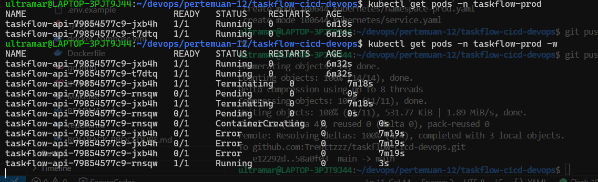
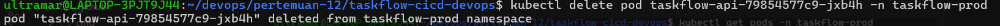

# Insiden 1 - Self-Healing Kubernetes

## Tujuan

Membuktikan bahwa jika salah satu Pod aplikasi mati, Kubernetes otomatis membuat Pod pengganti tanpa intervensi manual. Ini menjawab insiden container crash malam hari yang baru diketahui setelah klien komplain.

## Kondisi Awal

Deployment `taskflow-api` berjalan di namespace `taskflow-prod` dengan 2 replica.

Command pengecekan:

```bash
kubectl get deployment taskflow-api -n taskflow-prod
kubectl get pods -n taskflow-prod
```

Kondisi berhasil jika Deployment menunjukkan `READY 2/2` dan ada 2 Pod `1/1 Running`.

## Langkah Demo

Terminal 1 digunakan untuk memantau Pod secara real-time:

```bash
kubectl get pods -n taskflow-prod -w
```

Terminal 2 digunakan untuk menghapus salah satu Pod:

```bash
kubectl delete pod taskflow-api-79854577c9-jxb4h -n taskflow-prod
```

## Hasil

Setelah Pod dihapus, Kubernetes membuat Pod pengganti. Pada screenshot terlihat Pod lama berubah menjadi `Terminating`, kemudian Pod baru muncul dengan status `Pending`, `ContainerCreating`, dan akhirnya `Running`.



Command delete Pod berhasil dijalankan:



## Kesimpulan

Insiden container crash tidak perlu ditangani manual. Deployment menjaga jumlah replica tetap 2. Jika satu Pod hilang, ReplicaSet otomatis membuat Pod pengganti sampai kondisi yang diinginkan tercapai lagi.
