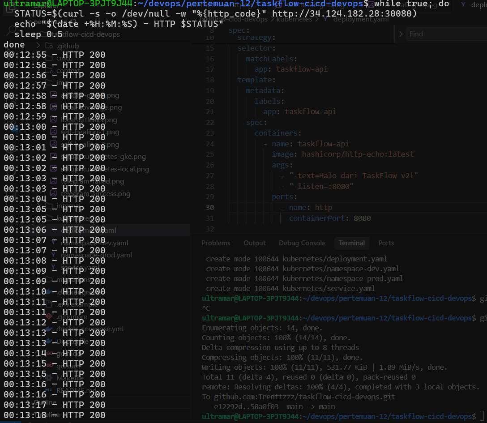
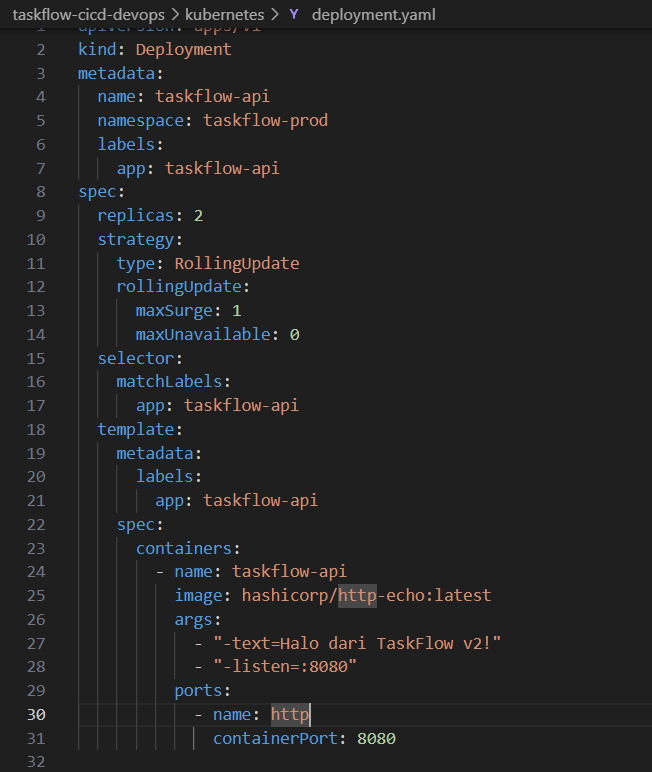
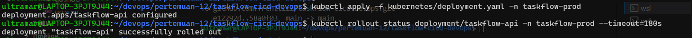

# Insiden 2 - Rolling Update Tanpa Downtime

## Tujuan

Membuktikan bahwa update aplikasi dapat dilakukan tanpa downtime. Ini menjawab insiden deploy fitur baru yang membuat aplikasi mati beberapa menit saat jam sibuk.

## Konfigurasi Deployment

Deployment `taskflow-api` memakai strategy rolling update:

```yaml
strategy:
  type: RollingUpdate
  rollingUpdate:
    maxSurge: 1
    maxUnavailable: 0
```

Maknanya:

- `maxSurge: 1` membolehkan Kubernetes membuat 1 Pod tambahan sementara saat update.
- `maxUnavailable: 0` mencegah Kubernetes mematikan Pod lama sebelum Pod baru siap.

## Langkah Demo

Terminal 1 menjalankan loop request ke service NodePort:

```bash
while true; do
  STATUS=$(curl -s -o /dev/null -w "%{http_code}" http://34.124.182.28:30080)
  echo "$(date +%H:%M:%S) - HTTP $STATUS"
  sleep 0.5
done
```

Terminal 2 mengubah response aplikasi dari:

```text
Halo dari TaskFlow v1!
```

menjadi:

```text
Halo dari TaskFlow v2!
```

Perubahan dilakukan di `kubernetes/deployment.yaml`, lalu di-apply:

```bash
kubectl apply -f kubernetes/deployment.yaml -n taskflow-prod
kubectl rollout status deployment/taskflow-api -n taskflow-prod --timeout=180s
```

## Hasil

Selama proses update, loop request tetap mengembalikan `HTTP 200`.



Perubahan versi response ada di manifest Deployment:



Rollout selesai dengan status sukses:



## Kesimpulan

Rolling update berhasil dilakukan tanpa downtime. Tidak ada `HTTP 000`, timeout, atau error 5xx pada loop request. Dengan strategy ini, aplikasi tetap tersedia selama proses update.
