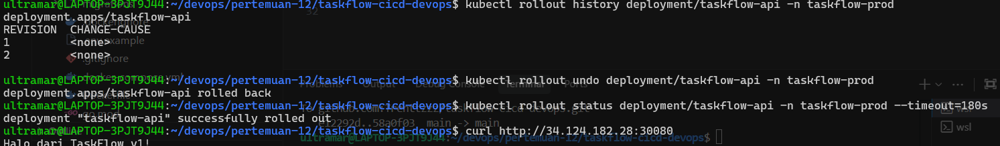

# Insiden 3 - Rollback Cepat

## Tujuan

Membuktikan bahwa versi aplikasi dapat dikembalikan dengan cepat menggunakan fitur rollback Kubernetes. Ini menjawab insiden rollback manual yang sebelumnya membutuhkan SSH, stop container, pull image lama, dan run ulang.

## Langkah Demo

Cek riwayat rollout:

```bash
kubectl rollout history deployment/taskflow-api -n taskflow-prod
```

Rollback ke revision sebelumnya:

```bash
kubectl rollout undo deployment/taskflow-api -n taskflow-prod
```

Tunggu rollback selesai:

```bash
kubectl rollout status deployment/taskflow-api -n taskflow-prod --timeout=180s
```

Verifikasi aplikasi:

```bash
curl http://34.124.182.28:30080
```

## Hasil

Kubernetes menampilkan riwayat revision, menjalankan rollback, lalu menyelesaikan rollout dengan sukses.



Setelah rollback, aplikasi kembali merespons versi sebelumnya:

```text
Halo dari TaskFlow v1!
```

## Perbandingan Cara Lama dan Kubernetes

| Aspek | Cara Lama | Dengan Kubernetes |
| --- | --- | --- |
| Langkah | SSH ke server, stop container, pull image lama, run ulang, cek config | `kubectl rollout undo deployment/taskflow-api -n taskflow-prod` |
| Waktu | Sekitar 25 menit sesuai skenario tugas | Kurang dari 60 detik, bahkan terhitung sangat cepat |
| Risiko | Tinggi, banyak langkah manual dan rawan salah | Lebih rendah karena rollback dikelola Deployment |
| Bukti hasil | Manual cek container dan log | `kubectl rollout status` dan curl ke service |

## Kesimpulan

Rollback Kubernetes jauh lebih cepat dan terkontrol. Tim tidak perlu menjalankan ulang container secara manual karena Deployment menyimpan riwayat rollout dan bisa kembali ke revision sebelumnya.
